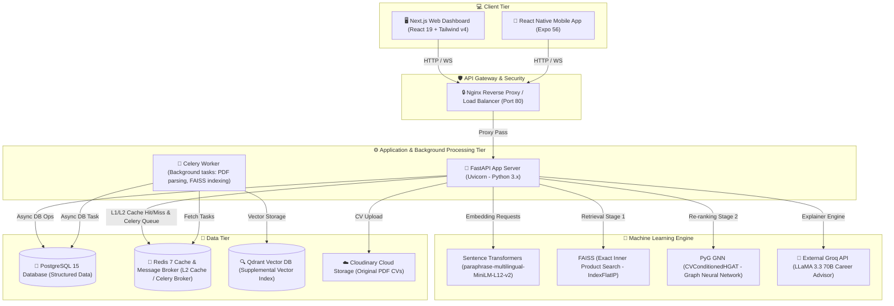

# 🚀 GRAPHIRE SYSTEM BLUEPRINT
### Đồ án Cơ sở 3: AI-Powered Job Recommendation System

[](https://github.com/)
[](https://www.python.org/)
[](https://fastapi.tiangolo.com/)
[](https://nextjs.org/)
[](https://reactnative.dev/)
[](https://tailwindcss.com/)
[](https://pytorch.org/)
[](https://github.com/facebookresearch/faiss)
[](https://redis.io/)
[](https://www.postgresql.org/)

Tài liệu này cung cấp một bản thiết kế (Blueprint) chi tiết về kiến trúc hệ thống, cấu trúc cơ sở dữ liệu, sơ đồ API, thuật toán khuyến nghị AI đặc thù và các cơ chế kỹ thuật cốt lõi của dự án **GraphHire** — Hệ thống đề xuất việc làm thông minh dựa trên mô hình mạng đồ thị dị thể (HGAT), tìm kiếm ngữ nghĩa FAISS, phân tích khoảng cách kỹ năng SLWG và AI tạo sinh Groq.

---

## 🗺️ 1. Tổng Quan Kiến Trúc Hệ Thống (System Architecture)

GraphHire được phát triển theo kiến trúc **Monorepo** sử dụng **Turborepo** và **pnpm workspace** để quản lý đồng thời cả ứng dụng Web Dashboard, Mobile Application, và Backend API Server.

### 1.1. Sơ đồ Kiến trúc Tổng thể (Architecture Diagram)



### 1.2. Cấu trúc Thư mục Monorepo (Monorepo Directory Structure)

```text
.
├── apps/
│   ├── api/            # FastAPI Backend (HGAT, FAISS, Postgres, Redis, CV Parsing)
│   │   ├── alembic/    # Database migrations (Alembic configuration)
│   │   ├── app/        # Mã nguồn lõi Python FastAPI
│   │   │   ├── api/    # Các router API theo các phân hệ chức năng
│   │   │   ├── core/   # Cấu hình bảo mật, phân quyền, middleware
│   │   │   ├── models/ # SQLAlchemy ORM Models (PostgreSQL Tables)
│   │   │   ├── ml/     # Chứa GNN (HGAT), FAISS, Qdrant, thuật toán SLWG
│   │   │   ├── schemas/# Pydantic DTOs cho Validation
│   │   │   ├── services/# Business logic services (Auth, CV, Pay, Chat, Recruiter)
│   │   │   └── tasks/  # Celery asynchronous tasks
│   │   └── tests/      # Bộ unit tests cho backend
│   ├── mobile/         # React Native / Expo Mobile Application
│   └── web/            # Next.js Web Application (GraphHire Dashboard)
│       ├── src/        # Next.js App Router, Components, Hooks, Stores
│       └── package.json
├── infra/              # Cấu hình Docker Infrastructure (Dev & Prod)
│   ├── docker-compose.dev.yml
│   └── docker-compose.yml
├── packages/           # Gói chia sẻ dùng chung cho các Client Apps
│   ├── eslint-config/  # Shared ESLint rules
│   ├── shared-types/   # Shared TypeScript Interfaces / DTOs
│   └── tsconfig/       # Base tsconfig
├── package.json        # Workspace Scripts (pnpm run dev, build, format)
├── pnpm-workspace.yaml # Định nghĩa pnpm monorepo workspace
└── turbo.json          # Cấu hình Turborepo build pipeline
```

---

## 🧠 2. Thiết Kế Động Cơ AI Recommendation Engine (AI Blueprint)

Động cơ AI Matching của GraphHire là một pipeline gồm **3 Giai Đoạn (Three-Stage Funnel Narrowing Pipeline)** giúp tối ưu hóa cả về **độ chính xác** lẫn **hiệu suất thời gian phản hồi** (latency < 2s).

```
   [TẤT CẢ CÔNG VIỆC] (Hàng chục ngàn jobs trong DB)
           │
           ▼  Giai đoạn 1: FAISS Vector Retrieval (paraphrase-multilingual-MiniLM-L12-v2)
       [TOP-50 JOBS] (Cosine Similarity ngữ nghĩa cao nhất)
           │
           ▼  Giai đoạn 2: CVConditionedHGAT Re-ranking (Message Passing trên Đồ thị Dị thể)
    [HGAT SCORES (1-50)] (Tích hợp structural context & SLWG bias)
           │
           ▼  Giai đoạn 3: Multi-factor Scoring (Tính điểm tổng hợp đa yếu tố)
     [TOP-K RESULTS] (Xếp hạng cuối cùng hiển thị cho ứng viên)
```

---

### Giai đoạn 1: FAISS Semantic Retrieval (Truy xuất Ngữ nghĩa Nhanh)

- **Mục tiêu**: Lọc nhanh từ hàng chục ngàn công việc xuống **Top-50** công việc có độ tương đồng ngữ nghĩa văn bản cao nhất với CV ứng viên.
- **Model**: `paraphrase-multilingual-MiniLM-L12-v2` Sentence-Transformer sinh vector nhúng dày đặc **384 chiều** cho cả CV và Job Description (JD).
- **Cơ chế**: Toàn bộ vector nhúng được **chuẩn hóa $L_2$** trước khi đánh chỉ mục:
  $$\|v\|_{2} = 1$$
  Nhờ đó, phép tính **Inner Product** (Tích vô hướng) trong FAISS tương đương trực tiếp với **Cosine Similarity** nhưng tốc độ xử lý ở mức cực nhanh (< 20ms):
  $$\text{score}_{\text{FAISS}} = \langle \vec{v}_{\text{CV}}, \vec{v}_{\text{JD}} \rangle$$
- **Index Type**: Meta FAISS `IndexFlatIP` (Exact search).

---

### Giai đoạn 2: CVConditionedHGAT Re-ranking (Xếp hạng lại bằng Đồ thị Dị thể)

Mô hình GNN Heterogeneous Graph Attention Network (HGAT) gồm **2 lớp truyền tin ($L=2$)**, **4 đầu chú ý ($H=4$)** và chiều ẩn **$hidden\_dim = 128$ ($4 \times 32$)**. 

#### 1. Đồ thị Dị thể G = (V, E)
Đồ thị chứa **5 loại nút** và **9 loại cạnh**:
- **Nodes**: `job` (công việc), `skill` (kỹ năng), `company` (công ty), `location` (địa điểm), `category` (danh mục).
- **Edges**: 
  - `("job", "requires", "skill")` / `("skill", "required_by", "job")`
  - `("job", "posted_by", "company")` / `("company", "posts", "job")`
  - `("job", "located_in", "location")` / `("location", "has", "job")`
  - `("job", "belongs_to", "category")` / `("category", "contains", "job")`
  - `("job", "similar_to", "job")`

#### 2. CV-Conditioned Attention (Phương trình 3)
Cơ chế attention giữa nút nguồn $i$ (ví dụ: `job`) và nút đích $j$ (ví dụ: `skill`) được định hướng trực tiếp bởi vector nhúng của CV ứng viên $h_{cv}$ đã được chiếu sang không gian ẩn thông qua phép chiếu $W_{cv}$:
$$e_{ij}^{(c,h)} = \left(\mathbf{a}_{src}^h \cdot \mathbf{h}_i^h\right) + \left(\mathbf{a}_{tgt}^h \cdot \mathbf{h}_j^h\right) + \left(\mathbf{h}_i^h \cdot \mathbf{h}_{cv}^{(c,h)}\right) + \left(\mathbf{h}_j^h \cdot \mathbf{h}_{cv}^{(c,h)}\right) - b_{ij}^{(c)}$$
Trong đó:
- $\mathbf{a}_{src}^h, \mathbf{a}_{tgt}^h \in \mathbb{R}^D$ là vector tham số attention của đầu $h$.
- $\mathbf{h}_{cv}^{(c,h)} \in \mathbb{R}^D$ là phân mảnh của vector nhúng CV ứng viên trên đầu $h$.
- $b_{ij}^{(c)}$ là trọng số phạt phi tuyến tính **SLWG Bias Injection** (xem chi tiết ở phần dưới).

#### 3. Attention Coefficient (Phương trình 4) & Aggregation (Phương trình 5)
Hệ số chú ý được chuẩn hóa bằng Softmax trên tập các nút lân cận của nút đích $j$:
$$\alpha_{ij}^{(c)} = \text{softmax}_j \left( \text{mean}_h \left[ e_{ij}^{(c,h)} \right] \right)$$
Tổng hợp thông tin đa đầu chú ý:
$$\mathbf{h}_j^{new} = \text{concat}_{h=1}^H \left[ \sum_{i \in \mathcal{N}(j)} \alpha_{ij}^{(c)} \cdot \left(\mathbf{W}_{src}^h \cdot \mathbf{h}_i\right) \right]$$

#### 4. Chuẩn hóa & Scoring (Phương trình 6 & 7)
Mỗi nút sau khi tổng hợp được đi qua Layer Normalization, hàm kích hoạt ReLU và Dropout:
$$\mathbf{h}_j^{out} = \text{Dropout} \left( \text{ReLU} \left( \text{LayerNorm} \left( \mathbf{h}_j^{new} \right) \right) \right)$$
Điểm phù hợp cấu trúc đồ thị giữa CV ứng viên $c'$ và Job $h_j$ được tính bằng:
$$\text{score}(c, j) = \text{cosine}(c', \mathbf{h}_j^{out})$$

---

### Giai đoạn 3: Multi-factor Scoring (Tính điểm Tổng hợp Đa yếu tố)

Sau khi HGAT xếp hạng lại 50 jobs, hệ thống tính toán điểm tổng hợp cuối cùng (`overall_score`) nhằm cân bằng giữa sự phù hợp ngữ nghĩa sâu trên đồ thị và các ràng buộc thực tiễn của ứng viên:

$$\text{overall\_score} = 0.5 \times \text{HGAT\_score} + 0.2 \times \text{skill\_match} + 0.1 \times \text{experience\_match} + 0.1 \times \text{salary\_match} + 0.1 \times \text{location\_match}$$

Trong đó:
- **`skill_match`**: Tỷ lệ kỹ năng đáp ứng (Jaccard Index cải tiến có trọng số learnability).
- **`experience_match`**: Mức độ tương thích giữa số năm kinh nghiệm yêu cầu của công việc và số năm kinh nghiệm của ứng viên (áp dụng hàm phạt tuyến tính nếu thiếu kinh nghiệm).
- **`salary_match`**: Tính toán độ bao phủ giữa dải lương mong muốn của ứng viên và ngân sách tuyển dụng của công ty.
- **`location_match`**: Điểm trùng khớp vị trí địa lý ưa thích (`preferred_locations`).

---

### Thuật toán SLWG (Skill Learnability-Weighted Gap)

Thuật toán đặc biệt của GraphHire giúp đánh giá khoảng cách kỹ năng dựa trên **độ khó học (Learnability Tier)** của các kỹ năng còn thiếu.

#### 1. Trọng số Phạt cố định (Equation 2)
Mỗi kỹ năng $s$ trong hệ thống được gán một trọng số phạt $\omega(s)$ phản ánh độ khó tiếp cận:
- **Easy tier ($S_{easy}$)**: $\omega = 0.1$ — Có thể tự học trong vài tuần (e.g. Git, Postman, Markdown, Slack).
- **Medium tier ($S_{medium}$)**: $\omega = 0.3$ — Cần 3-6 tháng học tập lý thuyết + thực hành (e.g. React.js, Docker, SQL, Python, FastAPI).
- **Hard tier ($S_{hard}$)**: $\omega = 0.7$ — Cần nhiều năm rèn luyện chuyên sâu (e.g. Kubernetes, System Design, Machine Learning, PyTorch, C++).

#### 2. Equation 1: Tính Bias cho cạnh Job-Skill
Nếu ứng viên thiếu kỹ năng $s$ bắt buộc của Job $j$, một bias $b_{js}^{(c)}$ sẽ được tạo ra:
$$b_{js}^{(c)} = \begin{cases} \omega(s) & \text{nếu } s \notin S_c \\ 0 & \text{nếu } s \in S_c \end{cases}$$

#### 3. Hai phương thức hoạt động (Dual Mode SLWG)
- **Mode A (GNN Tensor Mode)**: Trừ trực tiếp $b_{js}^{(c)}$ vào attention logit trên các cạnh `(job, requires, skill)` trong forward pass của GNN. Càng thiếu kỹ năng khó học, attention trên cạnh đó càng giảm mạnh, làm giảm điểm HGAT score một cách tự nhiên và khoa học.
- **Mode B (Advisory API Mode)**: Phân tích gap để sinh lộ trình học tập cá nhân hóa gửi về Client API dưới dạng:
  - `missing_required` (Danh sách kỹ năng bắt buộc thiếu kèm gợi ý lộ trình).
  - `missing_preferred` (Danh sách kỹ năng ưu tiên thiếu kèm gợi ý lộ trình).
  - `total_penalty`: Tổng điểm phạt SLWG $\sum \omega(s)$ (chỉ số gap).

---

## 💾 3. Thiết Kế Cơ Sở Dữ Liệu (PostgreSQL ERD Blueprint)

Dữ liệu quan hệ được thiết kế chuẩn hóa trên **PostgreSQL 15**, sử dụng SQLAlchemy ORM bất đồng bộ với driver `asyncpg`.

### 3.1. Sơ đồ Thực thể Liên kết (Entity Relationship Diagram - ERD)

```text
  +-------------------+        1      N +-------------------+
  |       users       |---------------->|        cvs        |
  |-------------------|                 |-------------------|
  | id (PK)           |                 | id (PK)           |
  | email (UQ)        |                 | user_id (FK)      |
  | hashed_password   |                 | cv_type           |
  | role              |                 | experience_years  |
  | subscription_tier |                 | embedding (Float[])|
  +-------------------+                 +-------------------+
            | 1                                   | 1
            |                                     |
            | N                                   | N
  +-------------------+                 +-------------------+
  |  job_applications |                 |     cv_skills     |
  |-------------------|                 |-------------------|
  | id (PK)           |                 | id (PK)           |
  | job_id (FK)       |                 | cv_id (FK)        |
  | applicant_id (FK) |                 | skill_id (FK)     |
  | cv_id (FK)        |                 | proficiency_level |
  +-------------------+                           | N
            | N                                   |
            |                                     | 1
            | 1                         +-------------------+
  +-------------------+                 |      skills       |
  |       jobs        |                 |-------------------|
  |-------------------|                 | id (PK)           |
  | id (PK)           |                 | name (UQ)         |
  | company_id (FK)   |                 | learnability_tier |
  | salary_min_vnd    |                 | learnability_weight|
  | embedding (Float[])|                +-------------------+
  +-------------------+                           | 1
            | 1                                   |
            |                                     | N
            | N                         +-------------------+
  +-------------------+                 |    job_skills     |
  |    job_matches    |                 |-------------------|
  |-------------------|                 | id (PK)           |
  | id (PK)           |                 | job_id (FK)       |
  | cv_id (FK)        |                 | skill_id (FK)     |
  | job_id (FK)       |                 | is_required       |
  +-------------------+
```

---

### 3.2. Đặc tả Chi tiết các Bảng Quan Trọng (Table Specifications)

#### Bảng: `users`
Lưu trữ thông tin tài khoản người dùng, phân quyền và trạng thái gói dịch vụ.
- `id` (INT, PK, Autoincrement)
- `email` (VARCHAR(255), Unique, Not Null, Index)
- `hashed_password` (VARCHAR(255), Not Null)
- `full_name` (VARCHAR(255))
- `role` (VARCHAR(20), Default: 'candidate') — Các vai trò: `candidate`, `recruiter`, `admin`
- `subscription_tier` (VARCHAR(20), Default: 'free') — Các gói: `free`, `premium`, `enterprise`
- `premium_until` (TIMESTAMP, Nullable)
- `is_active` (BOOLEAN, Default: True)
- `is_verified` (BOOLEAN, Default: False)
- `created_at` (TIMESTAMP, Default: now())

#### Bảng: `cvs`
Lưu trữ hồ sơ CV của ứng viên sau khi trích xuất và sinh vector nhúng.
- `id` (INT, PK, Autoincrement)
- `user_id` (INT, FK -> users.id, On Delete Cascade, Not Null)
- `cv_type` (VARCHAR(50), Default: 'experienced') — Phân loại: `intern` hoặc `experienced`
- `experience_years` (DECIMAL(4, 1))
- `current_salary_vnd` (BIGINT)
- `expected_salary_min_vnd` (BIGINT)
- `expected_salary_max_vnd` (BIGINT)
- `preferred_locations` (TEXT[], Mảng danh sách địa điểm mong muốn)
- `raw_text_vi` / `raw_text_en` (TEXT, Văn bản thô sau khi parse PDF/Word)
- `embedding` (ARRAY(Float), 384 dimensions)
- `is_primary` (BOOLEAN, Default: False) — CV chính dùng để AI matching tự động
- `created_at` / `updated_at` (TIMESTAMP)

#### Bảng: `cv_skills`
Mối quan hệ N-N giữa CV và kỹ năng, thể hiện các năng lực ứng viên sở hữu.
- `id` (INT, PK)
- `cv_id` (INT, FK -> cvs.id, On Delete Cascade, Not Null)
- `skill_id` (INT, FK -> skills.id, Not Null)
- `proficiency_level` (VARCHAR(20)) — Mức độ: `beginner`, `intermediate`, `advanced`, `expert`
- `years_experience` (DECIMAL(4, 1))
- `UniqueConstraint('cv_id', 'skill_id')`

#### Bảng: `skills`
Từ điển kỹ năng hệ thống (Taxonomy) đóng vai trò là các nút trên đồ thị.
- `id` (INT, PK)
- `name` (VARCHAR(255), Unique, Not Null, Index) — Tên kỹ năng dạng chuẩn hóa (e.g. "React.js")
- `name_vi` (VARCHAR(255))
- `learnability_tier` (VARCHAR(10), Not Null) — Độ khó học: `easy`, `medium`, `hard`
- `learnability_weight` (DECIMAL(3, 2), Not Null) — Trọng số phạt $\omega$: `0.1`, `0.3`, `0.7`
- `skill_category` (VARCHAR(50)) — Phân loại: `language`, `framework`, `tool`, `domain`, `soft`
- `parent_skill_id` (INT, FK -> skills.id, Nullable) — Cấu trúc phân cấp hình cây (e.g. JavaScript -> React.js)
- `esco_uri` / `onet_code` (VARCHAR(500), Dữ liệu chuẩn hóa quốc tế)
- `embedding` (ARRAY(Float))

#### Bảng: `jobs`
Lưu trữ thông tin chi tiết tin tuyển dụng.
- `id` (INT, PK)
- `job_id` (VARCHAR(50), Unique, Not Null, Index)
- `apply_url` (VARCHAR(1000))
- `title_vi` / `title_en` (TEXT, Tiêu đề song ngữ)
- `company_id` (INT, FK -> companies.id)
- `salary_min_vnd` / `salary_max_vnd` (BIGINT, Index)
- `experience_min_years` / `experience_max_years` (DECIMAL(4, 1), Index)
- `embedding` (ARRAY(Float), 384 dimensions)
- `faiss_index_id` (INT) — ID định danh trong chỉ mục FAISS để tra cứu nhanh vector
- `is_active` (BOOLEAN, Default: True, Index)
- `created_at` / `updated_at` (TIMESTAMP)

#### Bảng: `job_matches`
Lưu trữ kết quả tính toán AI Matching cho mỗi CV và Job cụ thể.
- `id` (INT, PK)
- `cv_id` (INT, FK -> cvs.id, On Delete Cascade, Not Null)
- `job_id` (INT, FK -> jobs.id, On Delete Cascade, Not Null)
- `hgat_score` (DECIMAL(7, 6)) — Cosine Similarity từ mô hình GNN HGAT
- `skill_match_score` (DECIMAL(5, 4))
- `experience_match_score` (DECIMAL(5, 4))
- `salary_match_score` (DECIMAL(5, 4))
- `location_match_score` (DECIMAL(5, 4))
- `overall_score` (DECIMAL(5, 4)) — Điểm tổng hợp cuối cùng dùng để xếp hạng
- `slwg_total_penalty` (DECIMAL(5, 4)) — Tổng điểm phạt khoảng cách kỹ năng
- `skill_gap_analysis` (JSONB) — Lưu vết chi tiết gap (danh sách kỹ năng thiếu, weight, suggestion)
- `explanation` (TEXT) — Lời khuyên định hướng sự nghiệp sinh bởi Groq AI LLaMA 3.3
- `rank_position` (INT) — Thứ tự xếp hạng trong danh sách đề xuất
- `computed_at` (TIMESTAMP, Default: now())
- `UniqueConstraint('cv_id', 'job_id')`

---

## ⚡ 4. Thiết Kế Bộ Nhớ Đệm Lai (Hybrid Caching Blueprint)

Nhằm giảm tải tính toán đồ thị nặng của HGAT và các truy xuất lặp lại, GraphHire thiết kế bộ nhớ đệm hai tầng kết hợp **L1 In-Memory** và **L2 Redis Distributed Cache**.

```
                       [Yêu cầu Đề xuất AI (POST /matching)]
                                        │
                                        ▼
                            🔍 KIỂM TRA L1 IN-MEMORY?
                           /                         \
                     (Hit L1)                      (Miss L1)
                       /                             \
                      ▼                               ▼
               [Trả về ngay] (0.5ms)          🔍 KIỂM TRA REDIS L2?
                                             /                     \
                                       (Hit L2)                  (Miss L2)
                                         /                         \
                                        ▼                           ▼
                                 [Ghi đè vào L1]          [⚙️ RUN AI PIPELINE]
                                 [Trả về kết quả]         (FAISS -> HGAT -> MultiScore)
                                      (10ms)                        │
                                                                    ▼
                                                            [Ghi vào cả L1 & L2]
                                                            [Trả về kết quả] (1.5s)
```

- **Tầng L1 (In-Memory)**: 
  - Thư viện: Python `collections.OrderedDict`
  - Eviction Policy: **Least Recently Used (LRU)**
  - Dung lượng tối đa: `1000` entries
  - TTL (Time To Live): `5 phút`
- **Tầng L2 (Phân tán - Redis)**:
  - Thư viện: `redis.asyncio`
  - TTL (Time To Live): `1 giờ` (Cấu hình qua `MATCH_CACHE_TTL`)
  - Định dạng: Tuần tự hóa JSON.

---

## 🔌 5. Bản Thiết Kế API Endpoints (API Blueprint)

Tất cả các endpoint đều có tiền tố là `/api/v1` và được bảo vệ bằng phân quyền vai trò dựa trên xác thực JWT (`Authorization: Bearer <token>`).

### 5.1. Phân hệ: Xác thực (`/auth`)

| Method | Endpoint | Auth | Quyền | Mô tả |
| :--- | :--- | :--- | :--- | :--- |
| `POST` | `/auth/register` | Không | All | Đăng ký tài khoản mới (mặc định: Candidate, mã hóa mật khẩu bcrypt). |
| `POST` | `/auth/login` | Không | All | Đăng nhập hệ thống, trả về JWT Access Token chứa `user_id`, `role`, và `tier`. |
| `GET` | `/auth/me` | Có | All | Trả về thông tin cá nhân của tài khoản hiện tại. |

---

### 5.2. Phân hệ: Quản lý CV (`/cvs`)

| Method | Endpoint | Auth | Quyền | Mô tả |
| :--- | :--- | :--- | :--- | :--- |
| `POST` | `/cvs/upload` | Có | Candidate | Tải lên tệp CV (PDF/DOCX). Lưu file vào Cloudinary, chạy NLP trích xuất kỹ năng/kinh nghiệm, tạo embedding, index vào FAISS. |
| `GET` | `/cvs` | Có | Candidate | Lấy danh sách toàn bộ CV của ứng viên. |
| `GET` | `/cvs/{id}` | Có | Candidate/Recruiter | Xem chi tiết CV đã phân tích, bao gồm tập kỹ năng trích xuất. |
| `PUT` | `/cvs/{id}/primary` | Có | Candidate | Đặt CV làm cấu hình chính để chạy đề xuất AI mặc định. |
| `DELETE` | `/cvs/{id}` | Có | Candidate | Xóa CV khỏi hệ thống và đồng bộ gỡ bỏ các bản ghi liên quan. |

---

### 5.3. Phân hệ: AI Matching & Đề xuất (`/matching`)

| Method | Endpoint | Auth | Quyền | Mô tả |
| :--- | :--- | :--- | :--- | :--- |
| `POST` | `/matching/recommend` | Có | Candidate | **Kích hoạt Pipeline AI 3 giai đoạn**: Thực hiện FAISS, HGAT re-ranking, SLWG gap analysis và Multi-factor scoring. Trả về danh sách xếp hạng. |
| `GET` | `/matching/gaps/{job_id}` | Có | Candidate | Phân tích chi tiết khoảng cách kỹ năng **SLWG Mode B** đối với một công việc cụ thể. Trả về danh sách gap và lộ trình suggestion. |
| `POST` | `/matching/{job_id}/explain` | Có | Candidate | **Gọi Groq LLaMA 3.3**: Sinh văn bản lời khuyên nghề nghiệp bằng tiếng Việt từ kết quả Gap Analysis của ứng viên. Cập nhật vào DB. |

---

### 5.4. Phân hệ: Tin Tuyển dụng (`/jobs`)

| Method | Endpoint | Auth | Quyền | Mô tả |
| :--- | :--- | :--- | :--- | :--- |
| `GET` | `/jobs` | Không | All | Lấy danh sách các công việc đang tuyển, hỗ trợ phân trang và tìm kiếm cơ bản. |
| `POST` | `/jobs` | Có | Recruiter | Đăng tin tuyển dụng mới. Tự động chuyển dịch song ngữ, tạo JD embedding, cập nhật chỉ mục FAISS theo thời gian thực. |
| `GET` | `/jobs/search/semantic` | Không | All | **Tìm kiếm việc làm ngữ nghĩa**: Nhận câu truy vấn tự nhiên (ví dụ: "Cần tìm việc làm lập trình ReactJS lương cao ở Đà Nẵng"), chạy FAISS IndexFlatIP trả về kết quả tương đồng ngữ nghĩa nhất. |
| `PUT` | `/jobs/{id}` | Có | Recruiter | Cập nhật thông tin công việc, đồng bộ cập nhật FAISS index. |
| `DELETE` | `/jobs/{id}` | Có | Recruiter | Xóa tin tuyển dụng (Soft delete). |

---

### 5.5. Phân hệ: Thanh toán & Subscription (`/payments`)

| Method | Endpoint | Auth | Quyền | Mô tả |
| :--- | :--- | :--- | :--- | :--- |
| `POST` | `/payments/subscribe` | Có | Candidate/Recruiter | Tạo yêu cầu nâng cấp tài khoản lên gói Premium, sinh mã thanh toán VietQR động. |
| `POST` | `/payments/webhook` | Không | VietQR Partner | Webhook tiếp nhận thông báo xác nhận giao dịch chuyển khoản thành công từ ngân hàng, tự động kích hoạt trạng thái Premium cho user. |

---

### 5.6. Phân hệ: Realtime Chat (`/chat`)

| Method | Endpoint | Auth | Quyền | Mô tả |
| :--- | :--- | :--- | :--- | :--- |
| `GET` | `/chat/rooms` | Có | All | Lấy danh sách phòng chat hiện có của người dùng (ứng viên liên kết với nhà tuyển dụng). |
| `GET` | `/chat/rooms/{room_id}/messages` | Có | All | Lấy lịch sử tin nhắn trong phòng. |
| `WS` | `/chat/ws/{room_id}` | Có | All | **WebSocket Connection**: Kết nối realtime trao đổi tin nhắn, cập nhật trạng thái đã xem (seen status). |

---

## 🚀 6. Triển Khai & Vận Hành (Deployment Blueprint)

GraphHire đóng gói toàn bộ hạ tầng thông qua **Docker Containers**, đảm bảo khả năng chạy nhất quán trên các môi trường local, staging, và production.

### 6.1. Dịch vụ Docker Compose (Docker-Compose Architecture)

Hệ thống quản lý **7 containers** giao tiếp nội bộ trong mạng ảo `graphhire-net`:

1. **`postgres`** (`postgres:15-alpine`):
   - Chịu trách nhiệm lưu trữ cơ sở dữ liệu quan hệ.
   - Sử dụng volume vật lý `postgres_data` để bảo toàn dữ liệu.
2. **`redis`** (`redis:7-alpine`):
   - Đảm nhận L2 Cache và Message Broker cho Celery.
   - Sử dụng volume `redis_data`.
3. **`qdrant`** (`qdrant/qdrant:v1.7.0`):
   - Cơ sở dữ liệu vector bổ trợ cho kế hoạch mở rộng trong tương lai.
4. **`api-migration`** (FastAPI codebase):
   - Chạy container trung gian tự động áp dụng `alembic upgrade head` để cập nhật cấu trúc bảng PostgreSQL trước khi khởi động API Server.
5. **`api`** (FastAPI app):
   - Dịch vụ backend chính, khởi động qua lệnh `uvicorn app.main:app --host 0.0.0.0 --port 8000`. Phụ thuộc vào trạng thái khỏe mạnh (`healthy`) của Postgres và Redis.
6. **`celery`** (FastAPI worker):
   - Container xử lý tác vụ nền bất đồng bộ (CV parsing, regenerate FAISS). Khởi động qua: `celery -A app.tasks.celery_app worker --loglevel=info`.
7. **`nginx`** (`nginx:alpine`):
   - Đóng vai trò là Reverse Proxy và API Gateway duy nhất mở cổng ra internet (Port 80). Phân phối requests đến `/api/` chuyển tiếp sang FastAPI server và phục vụ tĩnh frontend.

---

### 6.2. Hướng dẫn Chạy Hệ thống ở Môi trường Phát triển (Development Start)

Để khởi động toàn bộ stack dự án phục vụ phát triển cục bộ, thực hiện các bước sau:

```bash
# Bước 1: Cài đặt toàn bộ các dependency dùng chung và của các apps
pnpm install

# Bước 2: Thiết lập cấu hình biến môi trường
cp .env.example .env

# Bước 3: Khởi động các dịch vụ cơ sở hạ tầng (Postgres, Redis, VectorDB) dưới dạng nền
docker-compose -f infra/docker-compose.dev.yml up -d

# Bước 4: Chạy đồng thời cả Next.js, React Native và FastAPI API Server ở chế độ dev
pnpm run dev
```

> [!NOTE]
> Để khởi động riêng lẻ dịch vụ FastAPI phục vụ thử nghiệm Machine Learning độc lập, di chuyển vào thư mục api và chạy lệnh:
> `cd apps/api && uvicorn app.main:app --reload --port 8000`

---

## 🔒 7. Cơ Chế Bảo Mật & Đảm Bảo Hiệu Năng

GraphHire được tối ưu hóa đa tầng để vận hành ổn định trước các cuộc tấn công và lượng lớn truy cập:

1. **Bảo mật mạng & Headers**:
   - Tích hợp các tiêu đề bảo mật cao tại Middleware: `Content-Security-Policy` (CSP chặn script ngoài), `Strict-Transport-Security` (Bắt buộc HTTPS), `X-Frame-Options: DENY` (Chống Clickjacking), `X-Content-Type-Options: nosniff`.
   - CORS động được nạp trực tiếp từ biến môi trường `CORS_ORIGINS` tránh rò rỉ hoặc cấu hình cứng không an toàn.
2. **Xác thực và Phân quyền**:
   - Sử dụng chữ ký số JWT token kết hợp thuật toán mã hóa `HS256`, mật khẩu người dùng băm nâng cao bằng `bcrypt`.
3. **Giới hạn tần suất truy cập (Rate Limiting)**:
   - Triển khai middleware `SlowAPI` tại tầng ứng dụng.
   - Hạn chế động theo Subscription Tier: Tài khoản `free` giới hạn số lượt đề xuất và phân tích CV thấp hơn tài khoản `premium` nhằm bảo vệ chi phí gọi Groq API và suy luận đồ thị.
4. **Giám sát hệ thống (Prometheus Metrics)**:
   - Tích hợp endpoint `/api/v1/metrics` đo lường realtime các chỉ số:
     - `http_requests_total` (Đo lường lượng truy cập theo endpoint và status code).
     - `http_request_duration_seconds` (Đo lường độ trễ phản hồi API).
     - `match_inference_duration_seconds` (Đo lường chi tiết thời gian chạy suy luận mô hình GNN HGAT).

---

Tài liệu thiết kế này đóng vai trò là kim chỉ nam cho sự phát triển của **GraphHire**, đảm bảo tính nhất quán giữa cấu trúc lý thuyết và cài đặt thực tế.
